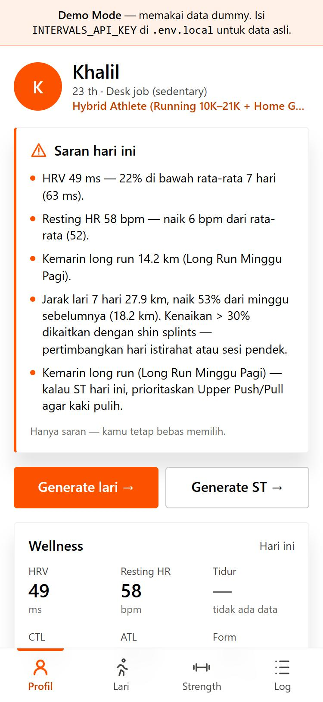
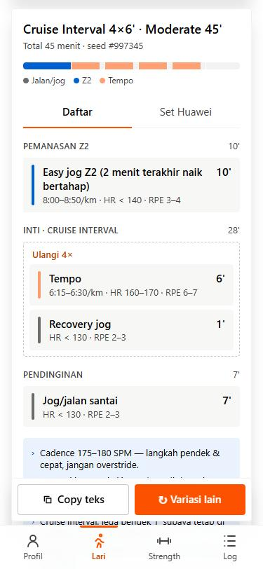
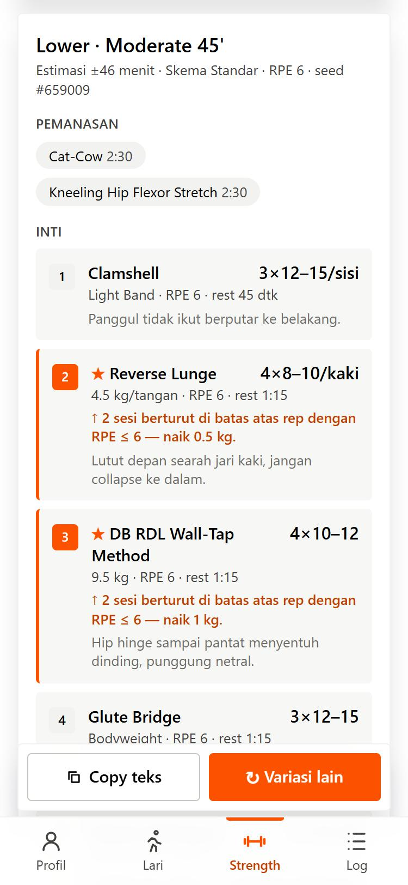
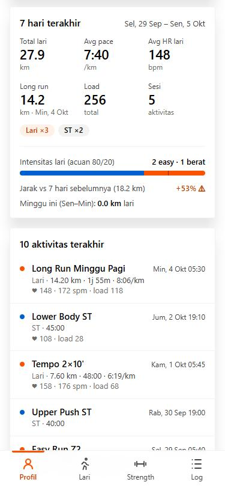
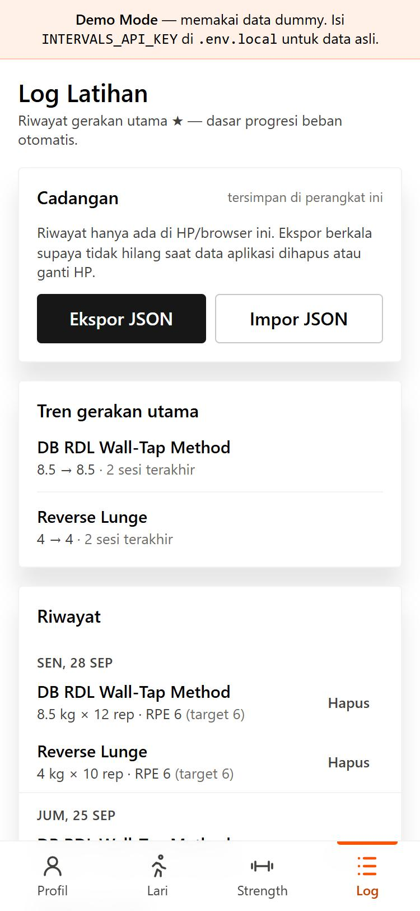
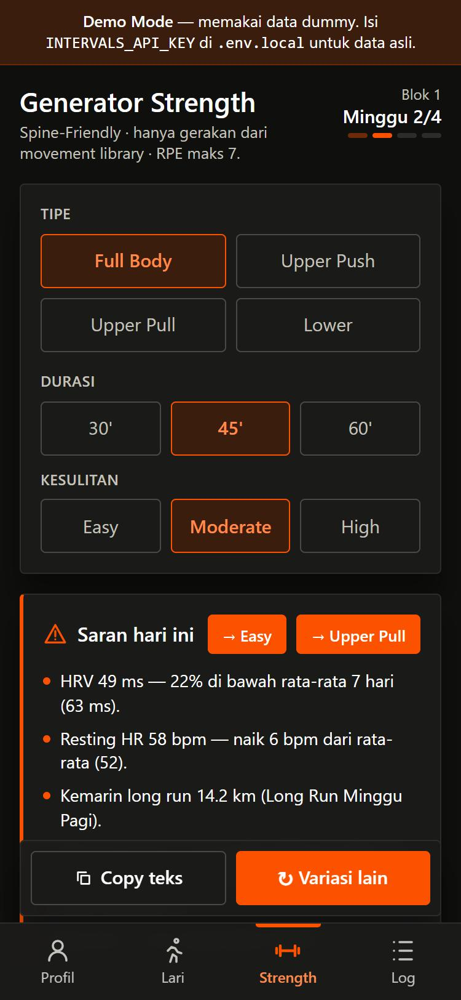

# Hybrid Athlete Dashboard

Dashboard pelatih pribadi untuk **hybrid athlete** (lari 10K–21K + strength training di rumah). Aplikasi ini membaca data latihan dan wellness dari [intervals.icu](https://intervals.icu), lalu membuat program **lari** dan **strength training (ST)** yang menyesuaikan diri dengan profil, kondisi cedera, dan kesiapan tubuh atlet hari itu.

Dibangun mobile-first sebagai **PWA**: bisa di-install ke layar utama HP dan dipakai seperti aplikasi native. Tampilannya mengikuti design system bergaya aplikasi olahraga: putih bersih, oranye energik, dan kontras tinggi supaya tetap terbaca di bawah matahari.


<table>
  <tr>
    <td></td>
    <td></td>
    <td></td>
  </tr>
  <tr>
    <td align="center"><sub>Profil &amp; saran hari ini</sub></td>
    <td align="center"><sub>Generator lari</sub></td>
    <td align="center"><sub>Generator ST + progresi beban</sub></td>
  </tr>
  <tr>
    <td></td>
    <td></td>
    <td></td>
  </tr>
  <tr>
    <td align="center"><sub>Ringkasan 7 hari (80/20, tren km)</sub></td>
    <td align="center"><sub>Log latihan</sub></td>
    <td align="center"><sub>Dark mode</sub></td>
  </tr>
</table>

<sub>Screenshot diambil dalam Demo Mode (data dummy).</sub>

---

## Kenapa project ini ada

Aplikasi latihan umumnya memberi program generik. Atlet ini punya kebutuhan spesifik yang tidak bisa diabaikan:

- **Anterior pelvic tilt / hiperlordosis:** tidak boleh ada beban axial berat tanpa tumpuan (Spine-Friendly Protocol).
- **Riwayat shin splints:** prehab wajib, dan kenaikan volume lari harus dijaga.
- **Overpronation / crossover gait:** latihan stabilitas panggul, dengan target cadence 175–180 SPM.
- **Home gym terbatas:** dumbbell modular, band, dan pull-up bar. Beban tidak boleh melebihi yang tersedia.

Semua aturan ini dikodekan sebagai **modul TypeScript murni yang diuji**, bukan sekadar teks di prompt. Hasil generator selalu divalidasi sebelum ditampilkan.

## Fitur

| Area | Yang bisa dilakukan |
| --- | --- |
| **Profil** | Data diri, target lomba, kondisi cedera, alat, zona lari, dan movement library. Semuanya dari satu file JSON. |
| **Data intervals.icu** | Ringkasan 7 hari (km, pace, HR, long run, load), 10 aktivitas terakhir, detail interval per aktivitas, serta wellness (HRV, resting HR, tidur, CTL/ATL/Form). |
| **Generator lari** | 30/45/60 menit × Easy/Moderate/High dengan 13 pola: Z2, run-walk, cadence drill, tempo, cruise interval, progression run, mini interval, Norwegian 4×4, dan 15/15. Target pace/HR/RPE diambil dari profil, dan durasinya selalu tepat. |
| **Generator ST** | Full Body / Upper Push / Upper Pull / Lower. Hanya memakai gerakan dari library, RPE ≤ 7, prehab dan stabilitas panggul wajib, serta memblokir beban axial berat. |
| **Periodisasi** | Blok 4 minggu (3 normal + 1 deload). Gerakan utama ★ dikunci per blok, sedangkan aksesori dan skema rep berputar. |
| **Saran hari ini** | Menggabungkan readiness (HRV, resting HR, sesi kemarin), distribusi 80/20, kenaikan km mingguan, dan jarak antara ST kaki dan lari berat. Sarannya bisa diterapkan dengan satu tap. |
| **Progresi beban** | Catat sesi, lalu beban berikutnya disesuaikan otomatis (aturan "2-for-2" NSCA) tanpa pernah melewati batas library. |
| **Salin cepat** | Teks ringkas untuk Strava/catatan HP, plus format "Set" untuk Huawei Health. |
| **Demo Mode** | Tanpa API key, aplikasi tetap berjalan penuh memakai data dummy. |
| **PWA & design system** | Bisa di-install ke HP dan full-screen. Token warna/tipografi terpusat (oranye `#fc5200`, biru info `#0060d0`, radius 4px, motion 150ms), plus dark mode, aman untuk notch, dan umpan balik sentuhan ala aplikasi native. |

Detail aturan dan dasar ilmiahnya ada di **[docs/TRAINING-LOGIC.md](docs/TRAINING-LOGIC.md)**.

## Progres pengembangan

| Versi | Status | Isi |
| --- | --- | --- |
| **0.1** Fondasi | ✅ Selesai | Profil + integrasi intervals.icu, generator lari & ST, validator aturan WAJIB, Demo Mode, readiness advisory, PWA, deploy Vercel |
| **0.2** Variasi terstruktur | ✅ Selesai | Periodisasi blok 4 minggu + deload, gerakan utama ★ per blok, rotasi skema rep, perpustakaan pola lari, target cadence personal, polesan UI mobile-native |
| **0.3** Konteks mingguan | ✅ Selesai | Aturan 80/20, peringatan kenaikan km > 30%, jarak concurrent training, kartu "Saran hari ini" dengan tombol aksi |
| **0.4** Progresi beban | ✅ Selesai | Log sesi di perangkat, progresi otomatis 2-for-2, halaman Log, ekspor/impor JSON |
| **0.5** Redesign UI | ✅ Selesai | Design system baru: token semantik, oranye sebagai warna utama, kartu ber-shadow, tipografi sistem, kontras teks AA, dark mode dari token yang sama |
| Berikutnya | 💡 Ide | Sinkron log antar perangkat (database), mode offline (service worker), grafik tren CTL/ATL, rencana mingguan otomatis |

Riwayat lengkap per versi ada di **[CHANGELOG.md](CHANGELOG.md)**.

## Tech stack

- **Next.js 16** (App Router, Server Components) + **React 19** + **TypeScript**
- **Tailwind CSS 4** dengan token semantik di [`app/globals.css`](app/globals.css). Dark mode mengikuti pengaturan sistem.
- **Vitest**: 5 file test, 80+ test yang mencakup seluruh kombinasi input generator
- **intervals.icu REST API**, dipanggil hanya dari server
- Tanpa database. Profil disimpan di JSON, log sesi di localStorage perangkat.
- Deploy di **Vercel**

Arsitektur dan alur data dijelaskan di **[docs/ARCHITECTURE.md](docs/ARCHITECTURE.md)**.

## Mulai cepat

Butuh Node.js 20.9 atau lebih baru.

```bash
git clone https://github.com/khaliladha11/hybrid-athlete-dashboard.git
cd hybrid-athlete-dashboard
npm install
npm run dev
```

Buka http://localhost:3000. Tanpa konfigurasi apa pun, aplikasi berjalan di **Demo Mode**.

### Hubungkan ke intervals.icu

1. Login ke https://intervals.icu, lalu buka **Settings → Developer Settings → Generate API Key**.
2. Salin `.env.example` menjadi `.env.local` dan isi:

   ```env
   INTERVALS_API_KEY=isi_api_key_kamu
   INTERVALS_ATHLETE_ID=0   # 0 = pemilik API key, atau ID seperti i123456
   ```

3. Restart `npm run dev`.

API key hanya dibaca di server (`import "server-only"`) dan tidak pernah dikirim ke browser. Error 401/403/404/5xx ditampilkan sebagai pesan singkat tanpa stack trace.

### Sesuaikan dengan atlet lain

Semua data atlet ada di [`config/athlete-profile.json`](config/athlete-profile.json):

- **`movementLibrary`**: whitelist gerakan dan batas beban (`"10–20 kg/tangan"`, `"Bodyweight"`, `"Light/Medium Band"`). Gerakan dengan `"available": false` dicatat tapi belum diresepkan.
- **`runZones`**: pace dan zona lari.
- **`training.blockStart`**: tanggal Senin awal blok periodisasi. Ubah tanggal ini untuk memulai blok baru.
- **`conditions`, `equipment`, `targets`**: ditampilkan di profil.

## Perintah

| Perintah | Fungsi |
| --- | --- |
| `npm run dev` | Server development |
| `npm test` | Semua unit test (Vitest) |
| `npm run typecheck` | Pemeriksaan TypeScript |
| `npm run build` | Build produksi |
| `npm run icons` | Render ulang ikon PWA dari `public/icon.svg` |

## Deploy ke Vercel

1. Import repo ini di https://vercel.com/new (preset Next.js terdeteksi otomatis).
2. Tambahkan environment variable `INTERVALS_API_KEY` dan `INTERVALS_ATHLETE_ID`.
3. Klik **Deploy**. Setiap `git push` ke `main` akan men-deploy ulang otomatis.

Kalau environment variable diubah setelah deploy, buka **Deployments → ⋯ → Redeploy**.

> **Privasi:** aplikasi belum punya login, jadi siapa pun yang tahu URL-nya bisa melihat data intervals.icu pemiliknya. Simpan URL secara privat, atau aktifkan **Settings → Deployment Protection → Vercel Authentication**.

## Install di HP

- **Android (Chrome):** buka URL Vercel → menu **⋮** → **Install aplikasi / Tambahkan ke Layar Utama**.
- **iPhone (Safari):** buka URL Vercel → tombol **Share** → **Tambah ke Layar Utama**.

Install PWA butuh HTTPS, jadi URL Vercel bisa langsung dipakai. Setelah ada deploy baru, tutup lalu buka lagi aplikasinya untuk memuat versi terbaru.

## Struktur project

```
app/                     halaman: Profil, /run, /strength, /log, /activity/[id]
components/              UI: profile/, generator/, log/, ui/
config/athlete-profile.json
lib/
  generator/             modul murni: run, strength, block (periodisasi), validate, format, rng
  intervals/             client (server-only), normalize, summary, data-source
  coach.ts               saran mingguan (80/20, progresi km, concurrent)
  progression.ts         aturan progresi beban 2-for-2
  training-log.ts        penyimpanan log di perangkat
  readiness.ts           sinyal kesiapan dari wellness
  mock-data.ts           data Demo Mode
public/                  manifest PWA & ikon
__tests__/               unit test Vitest
docs/                    dokumentasi & screenshot
```

## Dokumentasi

- **[docs/TRAINING-LOGIC.md](docs/TRAINING-LOGIC.md)**: semua aturan generator, periodisasi, saran, progresi beban, dan referensi ilmiahnya.
- **[docs/ARCHITECTURE.md](docs/ARCHITECTURE.md)**: arsitektur, alur data, batas keamanan, dan strategi testing.
- **[CHANGELOG.md](CHANGELOG.md)**: riwayat perubahan per versi.

## Disclaimer

Aplikasi ini adalah alat bantu perencanaan latihan pribadi, **bukan pengganti saran dokter, fisioterapis, atau pelatih bersertifikat**. Aturan di dalamnya dirancang untuk satu profil atlet tertentu. Sesuaikan dengan kondisimu sendiri, dan hentikan latihan bila muncul nyeri.
