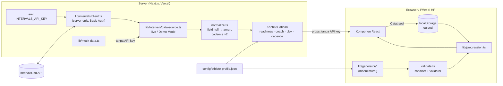

# Arsitektur

## Gambaran besar



## Prinsip desain

**1. API key tidak pernah sampai ke browser.** Semua panggilan intervals.icu ada di [`lib/intervals/client.ts`](../lib/intervals/client.ts), yang memakai `import "server-only"`, sehingga build akan gagal jika file ini diimpor dari komponen client. Halaman adalah Server Component yang mengambil data lalu mengirim hasil olahan (bukan key) sebagai props.

**2. Generator adalah fungsi murni.** `generateRunWorkout` dan `generateStrengthWorkout` menerima input + seed dan selalu mengembalikan hasil yang sama untuk input yang sama. Tidak ada I/O, tanggal, atau `Math.random()` di dalamnya. Semua konteks (blok periodisasi, cadence) masuk sebagai parameter. Karena itu generator bisa berjalan di browser (cepat, tanpa request) sekaligus diuji tuntas di Vitest.

**3. Pembuat pola ≠ penjaga aturan.** Pembuat pola (`run.ts`, `strength.ts`) bebas berkreasi. [`validate.ts`](../lib/generator/validate.ts) lalu:
- **menyanitasi**: membuang gerakan tidak terdaftar atau terlarang, meng-clamp RPE ≤ 7 dan beban ≤ batas library;
- **memvalidasi**: memeriksa prehab wajib, stabilitas panggul, urutan Upper Pull, dan toleransi durasi.

Pelanggaran akan melempar `WorkoutValidationError`. Hal yang sama berlaku untuk progresi beban: rekomendasi dari riwayat di-clamp lagi ke rentang library.

**4. Semua data eksternal dianggap bisa kosong.** Huawei Watch Fit 4 sering mengirim field null. [`normalize.ts`](../lib/intervals/normalize.ts) mengubah setiap field menjadi `number | undefined` yang aman, dan UI menampilkan "—". Aktivitas tanpa `id` dibuang.

**5. Zona waktu WIB.** Semua tanggal dihitung di UTC+7 ([`lib/date.ts`](../lib/date.ts)), dan minggu kalender dihitung Senin–Minggu.

## Modul

| Modul | Tanggung jawab | Berjalan di |
| --- | --- | --- |
| `lib/intervals/client.ts` | HTTP ke intervals.icu, Basic Auth, error terstruktur (401/403/404/5xx/timeout) | Server |
| `lib/intervals/data-source.ts` | Pilih data live atau Demo Mode, rakit `TrainingContext` | Server |
| `lib/intervals/normalize.ts` | Respons mentah → tipe aman | Server (dan mock) |
| `lib/intervals/summary.ts` | Ringkasan 7 hari, rata-rata cadence | Server |
| `lib/readiness.ts` | Sinyal HRV / resting HR / sesi kemarin | Server |
| `lib/coach.ts` | Saran 80/20, progresi km, concurrent, + `suggestFor()` | Server & client |
| `lib/generator/block.ts` | Posisi blok & deload dari tanggal | Server |
| `lib/generator/run.ts`, `strength.ts` | Pembuat pola | Client |
| `lib/generator/validate.ts` | Sanitizer + validator | Client |
| `lib/generator/variation.ts` | Deteksi variasi & seed berikutnya yang pasti berbeda | Client |
| `lib/generator/format.ts` | Teks salin & format Set Huawei | Client |
| `lib/progression.ts` | Aturan 2-for-2, penerapan ke workout | Client |
| `lib/training-log.ts` | Penyimpanan log (localStorage) + ekspor/impor | Client |

## Penyimpanan

| Data | Tempat | Alasan |
| --- | --- | --- |
| Profil atlet | `config/athlete-profile.json` di repo | Mudah diedit, ikut versi git |
| Data latihan & wellness | intervals.icu (dibaca, tidak disimpan) | Satu sumber kebenaran |
| Log sesi ST | `localStorage` perangkat | Tanpa setup/biaya. Data kesehatan tidak keluar dari HP. Cadangan lewat ekspor JSON |

Keterbatasannya, log hanya ada di satu perangkat. Jalur upgrade-nya adalah database (misalnya Upstash Redis lewat Vercel) dengan proteksi PIN/secret, karena aplikasi belum punya login.

## Design system

Semua gaya visual memakai **token semantik** di [`app/globals.css`](../app/globals.css), bukan warna Tailwind mentah. Komponen menulis `bg-surface`, `text-muted`, atau `bg-brand`. Tema gelap dipakai bila pengguna memilihnya lewat toggle (`<html data-theme="dark">`, disimpan di `localStorage`), atau mengikuti sistem bila belum ada pilihan. Script kecil di `<head>` memasang tema sebelum render supaya tidak berkedip. Komponen tidak memakai class `dark:`, karena cukup nilai token yang berganti.

| Token | Light | Dipakai untuk |
| --- | --- | --- |
| `brand` | `#fc5200` | CTA utama, navigasi aktif, gerakan ★, intensitas tinggi |
| `brand-ink` | `#c23f00` | Teks oranye di atas putih (kontras AA) |
| `brand-soft` | `#fff1e8` | Pilihan aktif, banner demo |
| `info` | `#0060d0` | Informasi, link, Z2, catatan workout |
| `ink` / `muted` / `faint` | `#000` / `#43423f` / `#6d6c68` | Teks utama / sekunder / meta |
| `line` | `#f2f2f0` | Border kartu & pemisah |
| `success` / `warning` / `danger` | `#16a34a` / `#eab308` / `#dc2626` | Intensitas Easy / Moderate / High, status aktif (hijau) / nonaktif (merah). Varian `-ink` untuk teks (kontras ≥ 4.5:1), `-soft` untuk latar |
| `shadow-card` | `0 20px 20px rgba(13,13,18,.1)` | Kartu |

Aturan lainnya: radius kartu 16px (`rounded-card`), tombol/input/pilihan 12px (`rounded-control`), baris di dalam kartu 12px (`rounded-inner`), motion 150ms `ease`, body 15px, heading 16px/600, area sentuh minimal 44px, dan outline fokus oranye 2px. Gaya tombol standar ada di `BUTTON` (`components/ui/Card.tsx`): primary, secondary, dan inverse. Pemetaan warna intensitas & status ada di satu tempat: `components/ui/tones.ts`.

## Testing

```bash
npm test
```

| File | Cakupan |
| --- | --- |
| `generator.test.ts` | Seluruh kombinasi input (9 lari + 36 ST) × 25 seed × 3 kondisi blok. Durasi ±2 menit, RPE ≤ 7, beban ≤ library, prehab wajib, whitelist gerakan, Spine-Friendly, dan sanitizer. |
| `periodization.test.ts` | Posisi blok & deload, gerakan ★ tetap per blok dan selalu multi-joint, rotasi skema rep, jumlah pola lari, target cadence. |
| `coach.test.ts` | Klasifikasi lari berat / ST kaki, 80/20, progresi km, concurrent, dan penggabungan saran tanpa penurunan berantai. |
| `progression.test.ts` | Aturan 2-for-2, tahan/turun, batas library, deload, gerakan tahan & band, validasi data impor. |
| `data.test.ts` | Tanggal WIB, normalisasi field null & cadence, ringkasan 7 hari, readiness. |

Generator diuji secara menyeluruh (setiap kombinasi × banyak seed), bukan hanya dengan beberapa contoh. Bug yang ditemukan saat pengembangan, seperti deload yang gagal memenuhi durasi atau beban yang terbulatkan salah, selalu disertai test baru.
